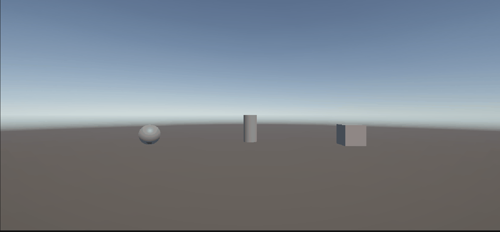
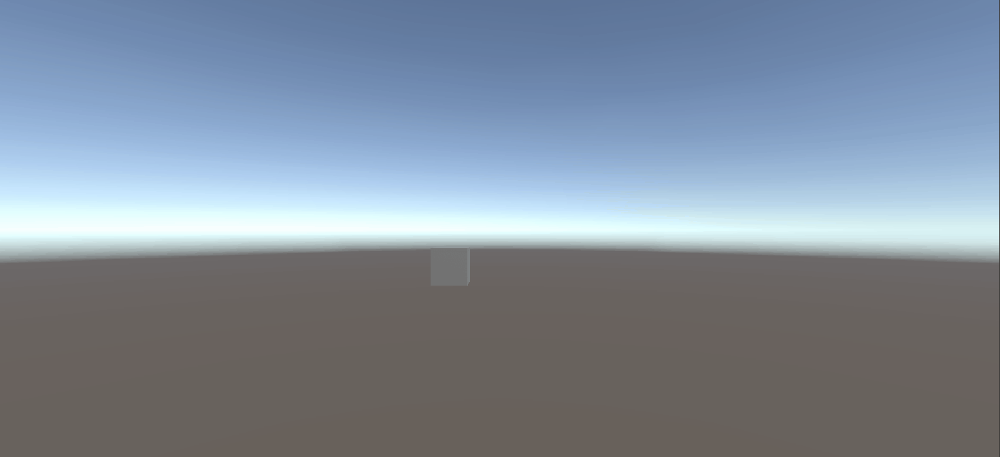

### Ejercicio 5: Desplazamiento de objetos mediante marcador e input

**Descripción:**
Modificación de las posiciones de tres objetos en la escena mediante un objeto marcador invisible que gestiona tres vectores de desplazamiento tras detectar la pulsación de la barra espaciadora.

**Hitos y lógica implementada:**
* **Marcador invisible:** Configuración de un GameObject central sin renderizador que almacena las referencias y vectores de desplazamiento de los objetos.
* **Mapeo de Input:** Uso de `Input.GetAxis("Jump")` para detectar el evento de la barra espaciadora en tiempo de ejecución.
* **Cálculo vectorial:** Aplicación de desplazamiento relativo agregando las componentes del vector $\Delta (x, y, z)$ a las coordenadas originales almacenadas durante el `Start()`.

### Ejercicio 6: Control de teclado y escalar de velocidad

**Descripción:**
Lectura e identificación de entradas de teclado mediante ejes ortogonales (`Horizontal` y `Vertical`) combinados con la detección de teclas físicas mediante `KeyCode`, multiplicados por una variable escalar de velocidad configurable.

**Hitos y lógica implementada:**
* **Velocidad parametrizada:** Definición de una variable pública `velocidad` editable en tiempo real desde el inspector.
* **Lectura doble de Input:** Uso simultáneo de `Input.GetAxis()` para obtener el rango $(-1.0, 1.0)$ y `Input.GetKey(KeyCode...)` para identificar la tecla concreta presionada.
* **Reporte contextual:** Muestreo en consola que encabeza el mensaje con el nombre de la flecha activa y calcula la multiplicación escalar en tiempo real.

### Ejercicio 7: Mapeo de entradas mediante el Input Manager

**Descripción:**
Redefinición y personalización de ejes de entrada virtuales en el proyecto para vincular una tecla física concreta (`H`) a una acción lógica de disparo.

**Hitos y lógica Implementada:**
* **Configuración de ejes:** Creación y mapeo del botón virtual `Disparo` asociado al valor positivo de la tecla `h` en `Project Settings -> Input Manager`.
* **Abstracción del Input:** Implementación de `Input.GetButtonDown()` en el código en lugar de `Input.GetKeyDown(KeyCode.H)`, independizando la lógica del código de la configuración de hardware.
* **Confirmación por consola:** Registro de eventos de disparo al presionar la tecla asignada durante la ejecución.

### Ejercicio 8: Traslación continua, escalas y sistemas de referencia

**Descripción:**
Traslación progresiva de un cubo mediante el método `transform.Translate()` parametrizada por un vector dirección (`moveDirection`) y un escalar de velocidad (`speed`), evaluando la diferencia entre el espacio local y el espacio global.

---

#### Hitos y lógica implementada
* **Parametrización en el Inspector:** Variables públicas para la dirección (`moveDirection`) y la velocidad (`speed`), fijando inicialmente una velocidad superior a 1 y la posición inicial en $Y = 0$.
* **Implementación de traslación:** Uso del método `transform.Translate()` escalado por la velocidad y `Time.deltaTime` para mantener la fluidez independientemente de los frames por segundo.
* **Alternancia de referenciales:** Control configurable para alternar entre el sistema de referencia local (`Space.Self`) y el global (`Space.World`).

---

#### Informe y análisis de resultados

* **Duplicar las coordenadas de la dirección del movimiento (`moveDirection`):**
  * *Resultado:* La velocidad efectiva del cubo **se duplica**.
  * *Explicación:* Al no normalizar el vector dirección, las componentes de `moveDirection` actúan directamente como un factor multiplicador de la magnitud del desplazamiento en cada frame.

* **Duplicar la velocidad manteniendo la dirección del movimiento:**
  * *Resultado:* El cubo recorre la misma trayectoria rectilínea a **el doble de unidades por segundo**, tardando la mitad de tiempo en alcanzar un punto determinado.
  * *Explicación:* El escalar `speed` escala linealmente la magnitud del movimiento por unidad de tiempo sin alterar la orientación fija dada por el vector dirección.

* **Utilizar una velocidad menor que 1 (ej. `speed = 0.5`):**
  * *Resultado:* El desplazamiento se vuelve **más lento y pausado**, pero conserva una traslación fluida.
  * *Explicación:* La traslación aplicada al `Transform` en cada frame es una fracción reducida de la unidad, permitiendo movimientos de alta precisión o a cámara lenta.

* **Posición del cubo con $Y > 0$ (ej. $Y = 3.0$):**
  * *Resultado:* El cubo se desplaza **suspendido en el aire** manteniendo su cota de altura constante ($Y = 3.0$).
  * *Explicación:* Si el vector `moveDirection` no incluye componentes en el eje $Y$, la coordenada vertical del objeto no sufre alteraciones durante la traslación.

* **Intercambio entre sistema de referencia local (`Space.Self`) y mundial (`Space.World`):**
  * *`Space.World` (Mundial):* El cubo se desplaza en la dirección absoluta de los ejes del escenario (por ejemplo, $+X$ siempre es la derecha global), sin importar la rotación propia del cubo.
  * *`Space.Self` (Local):* El cubo se traslada según su propia orientación. Si el cubo está rotado, desplazarse en $+X$ seguirá la dirección de su propio eje derecho local, moviéndose en diagonal respecto al mundo.

---

### Ejercicio 9: Control simultáneo de múltiples objetos mediante diferentes entradas

**Descripción:**
Implementación de esquemas de control independientes para dos objetos en escena (Cubo y Esfera) mediante `transform.Translate()` y detección de teclas específicas en tiempo real.

---

#### Hitos y lógica implementada
* **Doble Control Independiente:** Asignación de scripts dedicados a cada objeto para independizar el manejo de entradas por hardware.
* **Mapeo de Flechas (Cubo):** Control del movimiento horizontal ($X$) y vertical ($Y$) mediante `KeyCode.UpArrow`, `KeyCode.DownArrow`, `KeyCode.RightArrow` y `KeyCode.LeftArrow`.
* **Mapeo WASD (Esfera):** Control paralelo de movimiento horizontal y vertical utilizando la combinación clásica de teclas `W`, `A`, `S` y `D`.
---

### Ejercicio 10: Suavizado e independencia de frame rate mediante `Time.deltaTime`

**Descripción:**
Adaptación de los esquemas de movimiento del cubo y la esfera para escalar el desplazamiento proporcionalmente al tiempo transcurrido entre fotogramas.

---

#### Hitos y lógica implementada
* **Uso de `Time.deltaTime`:** Incorporación del delta de tiempo en la ecuación de traslación:
  $$\text{Desplazamiento} = \text{Dirección} \times \text{Speed} \times \text{Time.deltaTime}$$
* **Independencia de rendimiento:** Corrección del cálculo para garantizar que la velocidad parametrizada en la variable `speed` represente **unidades reales por segundo** y no unidades por fotograma.
* **Fluidez continuada:** Movimiento consistente y uniforme independientemente de variaciones o bajadas en los FPS de la ejecución.

---

### Ejercicio 10: Suavizado e independencia de frame rate mediante `Time.deltaTime`

**Descripción:**
Adaptación de los esquemas de movimiento del Cubo y la Esfera (desarrollados en el Ejercicio 9) para escalar el desplazamiento proporcionalmente al tiempo transcurrido entre fotogramas.

---

#### Hitos y lógica implementada
* **Uso de `Time.deltaTime`:** Incorporación del delta de tiempo en la ecuación de traslación:
  $$\text{Desplazamiento} = \text{Dirección} \times \text{Speed} \times \text{Time.deltaTime}$$
* **Independencia de rendimiento:** Corrección del cálculo para garantizar que la velocidad parametrizada en la variable `speed` represente **unidades reales por segundo** y no unidades por fotograma.
* **Fluidez continuada:** Movimiento consistente y uniforme independientemente de variaciones o bajadas en los FPS de la ejecución.

---

### Ejercicio 11: Persecución de objetivo con normalización de vector dirección

**Descripción:**
Adaptación del movimiento del cubo para perseguir de forma continua a la esfera, garantizando un avance uniforme independiente de la distancia entre ambos objetos y manteniendo constante la cota de altura.

---

#### Hitos y lógica implementada
* **Vector dirección relativo:** Cálculo del vector que conecta ambos objetos mediante resta de posiciones ($\text{Posición}_{\text{Esfera}} - \text{Posición}_{\text{Cubo}}$).
* **Restricción de altura:** Anulación de la componente vertical ($\text{direccion.y} = 0$) para restringir la traslación al plano horizontal.
* **Normalización de magnitud (`.normalized`):** Escalado del vector dirección a magnitud unitaria ($1.0$) para evitar aceleraciones o desaceleraciones no deseadas en función de la distancia.
* **Integración temporal:** Traslación uniforme mediante `speed * Time.deltaTime` en coordenadas globales (`Space.World`).

---

### Ejercicio 12: Orientación dinámica (`LookAt`) y persecución local

**Descripción:**
Adaptación del movimiento de persecución del cubo integrando la rotación dinámica mediante `transform.LookAt()` para garantizar que su eje $+Z$ local apunte constantemente hacia la Esfera mientras se desplaza.

---

#### Hitos y lógica implementada
* **Orientación continua (`LookAt`):** Rotación automática del objeto en cada frame para alinear su eje $+Z$ local con la posición objetivo.
* **Restricción de eje vertical:** Proyección del punto objetivo a la misma coordenada $Y$ del cubo para evitar inclinaciones accidentales en los ejes $X$ o $Z$.
* **Traslación en espacio local (`Space.Self`):** Avance en la dirección `Vector3.forward` aprovechando que la orientación local del cubo ya se encuentra apuntando hacia el objetivo.
* **Manejo dinámico con WASD:** Validación de la persecución reactiva al desplazar libremente la esfera con el teclado por el escenario.

---

### Ejercicio 13: Giro y avance basado en la orientación del objeto (`transform.forward`)

**Descripción:**
Implementación del esquema de control por orientación local, donde el eje horizontal gira el objeto sobre su eje $Y$ y el desplazamiento se realiza en la dirección hacia adelante local (`transform.forward`).

---

#### Hitos y lógica implementada
* **Rotación angular (`transform.Rotate`):** Uso de `Input.GetAxis("Horizontal")` para aplicar un giro suave parametrizado por `turnSpeed * Time.deltaTime`.
* **Uso de `transform.forward`:** Obtención del vector dirección real en coordenadas globales para trasladar al objeto hacia donde apunta su eje $+Z$ local.
* **Depuración visual (`Debug.DrawRay`):** Proyección de un rayo vectorial en el viewport de escena para verificar visualmente la dirección del avance en tiempo real.

---

